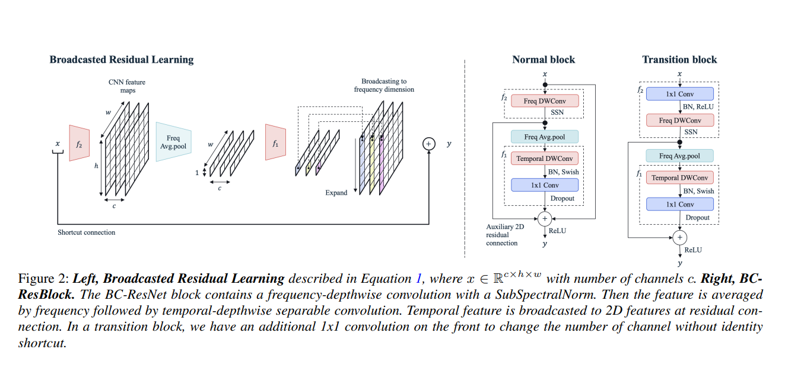
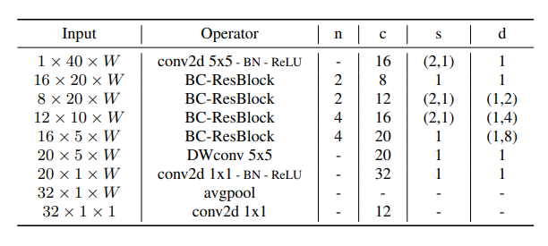

# Keyword spotting z implementacją embedding'u wektora mówców

Fuzja prac: https://arxiv.org/abs/2106.04140 oraz https://arxiv.org/html/2403.07802v1

prace pomocnicze/uzupełniające: 
- SSN: https://arxiv.org/abs/2103.13620
- Swish/SiLU: https://arxiv.org/abs/1710.05941v1

### Budowa bloków BC-ResNet:

### Schemat architektury BC-ResNet:

### Embedding mówcy

#### Backbone: BC-ResNet-1
#### Fuse point: multiplication by user embeddings

