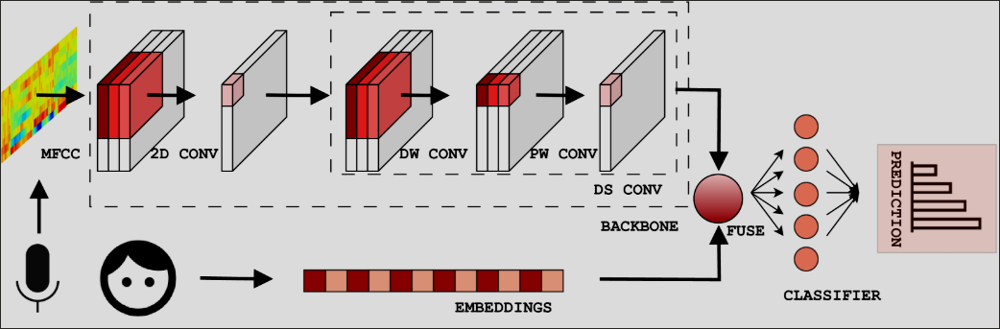

# Keyword spotting z implementacją embedding'u wektora mówców

Fuzja prac: https://arxiv.org/abs/2106.04140 oraz https://arxiv.org/html/2403.07802v1

prace pomocnicze/uzupełniające: 
- SSN: https://arxiv.org/abs/2103.13620
- Swish/SiLU: https://arxiv.org/abs/1710.05941v1

## Budowa bloków BC-ResNet:


**Występują 2 typy bloków: *przejściowe* oraz *normalne*.**
Główna różnica polega na tym, że jeden zmienia ilość kanałów wyjściowych, a drugi nie. 
Ich wizualizacja powyżej. Trik polega na skorzystaniu z point-wise convolution 
na początku bloku *przejściowego*. Tym samym, nieobecne jest połączenie rezydualne podające
czysty *x* do końcowego argumentu dla aktywacji - jak w przypadku bloku *normalnego*.

## Schemat architektury BC-ResNet-1:


## Embedding mówcy

#### Backbone: BC-ResNet-1
#### Fuse point: addition of user embeddings



## Zaimplementowano:

### Przygotowanie danych w `dataset.py`

- **`TARGET_LABELS`** – keywords, które model ma nauczyć się rozpoznawać (np. `yes`, `no`, `up`, `down`, …)
- **`AUXILIARY`** – dodatkowe słowa traktowane jako kategorię „unknown" (np. `cat`, `dog`, `happy`, …)
- **`IndexBuilder`** – klasa do budowy podziałów na zbiory (train/val/test) oraz dostarczania statystyk
- **`SpeechCommandsKWS`** – klasa dziedzicząca po `Dataset` PyTorch, która konwertuje audio na mel-spektrogramy i balansuje klas

## Bloki sieci BC-Res-Net-1 `blocks.py`

### 1. Klasa `SSN` (SubSpectral Normalisation)

1. dzieli wymiar **częstotliwości** `F` na `S` podpasm
2. dla każdego podpasma liczy osobno średnią i wariancję
3. normalizuje każde podpasmo niezależnie (ale w ramach tych samych kanałów)
4. ma osobne parametry **gamma** i **beta** dla każdego podpasma

**ISTOTNE**

`S = 1` → zwykłe batch norm
`S > 1` → normalizacja z podziałem na podpasma

### 2. Klasa `ConvBNReLU`

Składa się z:

```
x → Conv2d (bias=False) → BatchNorm2d → ReLU(inplace=True) → y
```
Obecny w **BC-ResNet-1** w podstrukturach:

- **Head** – konwolucja `5x5` ze stride `(2,1)` przy wstępnym przetwarzaniu logmel-spektrogramu
- **Tail** – konwolucja `1x1` do zwiększenia liczby kanałów przed poolingiem

---

### 3. Klasa `BCResBlock`

Zgodnie z artykułem:

$y = \text{ReLU}(x + f_2(x) + \text{broadcast}(f_1(\text{avg_pool}(f_2(x)))))$

`f2` **(część frequency-depthwise):**
- Conv2d depthwise `3x1` (wymiar częstotliwości) ze `stride`, `padding=(1,0)`, `groups=out_channels`
- SubSpectral Normalisation (SSN)
- (jeśli `is_transition=True` i zmienia się liczba kanałów to najpierw Conv2d `1x1` (pointwise) + BatchNorm2d + ReLU)

`f1` **(część temporal-depthwise):**
- Average pooling po wymiarze częstotliwości: `[B, Ch, F, W]` → `[B, Ch, 1, W]` 
- Conv2d depthwise `1x3` (właśnie wymiaru czasowego) z `dilation`, `padding=(0, dilation[1])`, `groups=out_channels`
- BatchNorm2d
- SiLU (Swish) – $(x \cdot \sigma(x))$
- Conv2d pointwise `1x1`
- Dropout2d

### sieć BC-ResNet-1 `bcresnet1.py`

Nasz **BC-ResNet-1** do klasyfikacji mowy:
- przyjmuje na wejściu **logmel-spektrogram** o kształcie `[B, 1, 40, 101]` (batch, kanały, pasma melowe, ramki czasowe),
- przetwarza go przez bloki wspomniane wyżej,
- zwraca zredukowany w wymiarach, **wektor cech** o kształcie `[B, 32]`, 
który potem łączony jest z wektorem cech embedding'u o tym samym kształcie (addycja)


### sieć ostateczna `kwsnet.py`

Tutaj następuje połączenie sieci BC-ResNet-1 z warstwą embedding'u. 
Fuzja jest zrealizowana przez addycję **wektora mówców** do map cech stworzonych przez
**backbone**.
