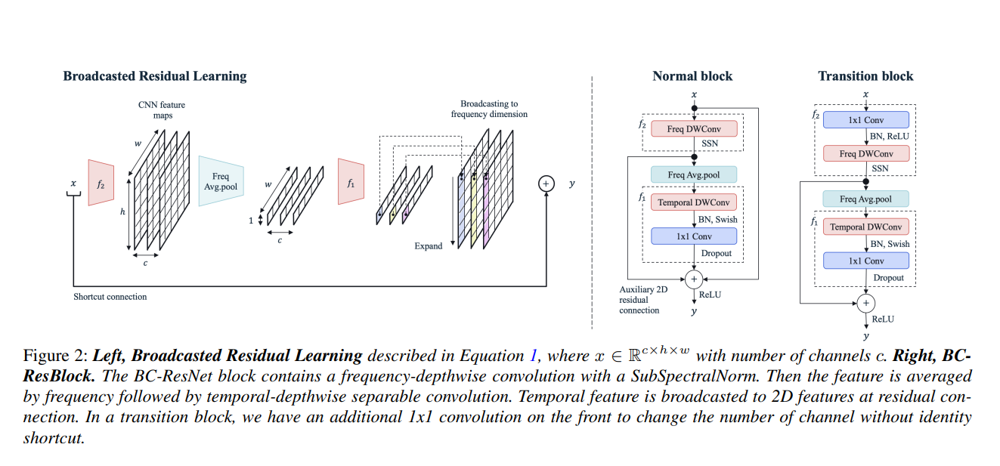
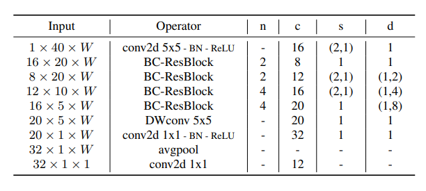
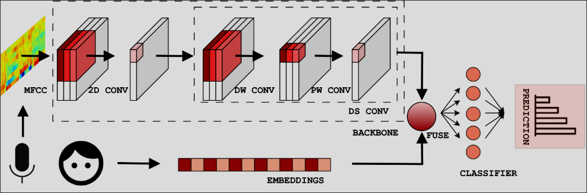

# Keyword Spotting with Speaker Vector Embedding Implementation

**Fusions of works:** https://arxiv.org/abs/2106.04140 and https://arxiv.org/html/2403.07802v1

**Auxiliary/Supporting papers:** 
- **SSN:** https://arxiv.org/abs/2103.13620
- **Swish/SiLU:** https://arxiv.org/abs/1710.05941v1

## BC-ResNet Block Architecture

**There are 2 block types: *transition* and *normal*.**
The primary difference lies in whether the block modifies the number of output channels. 
Their visualisation is shown above. The trick involves using a *point-wise convolution* at the beginning of the *transition* block. Consequently, the residual connection that feeds the clean $x$ to the final activation argument is absent — unlike in the *normal* block.

## BC-ResNet-1 Architecture Schema

## Speaker Embedding

#### Backbone: BC-ResNet-1
#### Fuse point: addition of user embeddings

## Implemented:

### Data Preparation in `dataset.py`

- **`TARGET_LABELS`** – keywords that the model is trained to recognise (e.g. `yes`, `no`, `up`, `down`, …)
- **`AUXILIARY`** – supplementary words treated as the "unknown" category (e.g. `cat`, `dog`, `happy`, …)
- **`SplitBuilder`** – a class designed to construct and store dataset splits (train/val/test)
- **`SpeechCommandsKWS`** – a class inheriting from PyTorch's `Dataset`, which handles class balancing and converts audio signals into mel-spectrograms

## BC-ResNet-1 Network Blocks `blocks.py`

### 1. `SSN` Class (SubSpectral Normalisation)

1. Partitions the **frequency** dimension `F` into `S` sub-bands.
2. Calculates the mean and variance independently for each sub-band.
3. Normalises each sub-band independently (retaining the original channels).
4. Maintains dedicated **gamma** and **beta** learnable parameters for each sub-band.

**IMPORTANT**

`S = 1` → standard Batch Normalisation  
`S > 1` → normalisation performed per sub-band partition

### 2. `ConvBNReLU` Class

Consists of:
`x → Conv2d (bias=False) → BatchNorm2d → ReLU(inplace=True) → y`

Utilised in **BC-ResNet-1** within the following sub-structures:

- **Head** – a `5x5` convolution with `(2,1)` stride, used during initial log-mel spectrogram processing.
- **Tail** – a `1x1` convolution utilized to increase the channel count prior to pooling.

---

### 3. `BCResBlock` Class
According to the paper: 
\
$$y = \text{ReLU}(x + f_2(x) + \text{broadcast}(f_1(\text{avg}_{\text{pool}}(f_2(x)))))$$

`f2` **(frequency-depthwise stage):**
- Depthwise Conv2d `3x1` (frequency dimension) with `stride`, `padding=(1,0)`, and `groups=out_channels`
- SubSpectral Normalisation (SSN)
- (If `is_transition=True` and the channel count changes, a preceding `1x1` Conv2d (point-wise) + BatchNorm2d + ReLU is applied)

`f1` **(temporal-depthwise stage):**
- Average pooling along the frequency dimension: `[B, Ch, F, W]` $\rightarrow$ `[B, Ch, 1, W]` 
- Depthwise Conv2d `1x3` (temporal dimension) with `dilation`, `padding=(0, dilation[1])`, and `groups=out_channels`
- BatchNorm2d
- SiLU (Swish) – $(x \cdot \sigma(x))$
- Point-wise Conv2d `1x1`
- Dropout2d

### BC-ResNet-1 Network `bcresnet1.py`

Our **BC-ResNet-1** designed for speech classification:
- Accepts a **log-mel spectrogram** input of shape `[B, 1, 40, 101]` (batch size, channel, mel-bands, time frames).
- Processes the input through the architectural blocks detailed above.
- Returns a dimensionally-reduced **feature vector** of shape `[B, 32]`, which is subsequently fused with a speaker embedding feature vector of the same shape (via addition).

### Final Network `kwsnet.py`

This module integrates the BC-ResNet-1 network with the speaker embedding layer. The fusion is achieved by performing additive integration (addition) of the **speaker vector** directly into the feature maps generated by the **backbone**.
